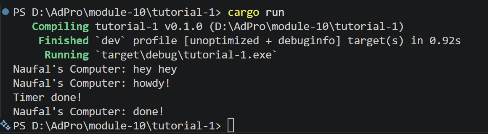

**Tutorial 1**

- Tulisan "hey hey" muncul lebih dahulu karena task async yang di-spawn belum langsung dijalankan. Saat spawner.spawn() dipanggil, task hanya dimasukkan ke dalam queue executor. Program kemudian langsung melanjutkan eksekusi ke baris berikutnya yaitu println!("hey hey"). Task async baru benar-benar dijalankan ketika executor.run() dipanggil. Executor mengambil task dari queue lalu melakukan polling terhadap future. Ketika mencapai .await, future akan berada pada status pending sampai timer selesai. Setelah timer selesai, waker akan membangunkan task sehingga executor dapat melanjutkan eksekusi future sampai selesai.