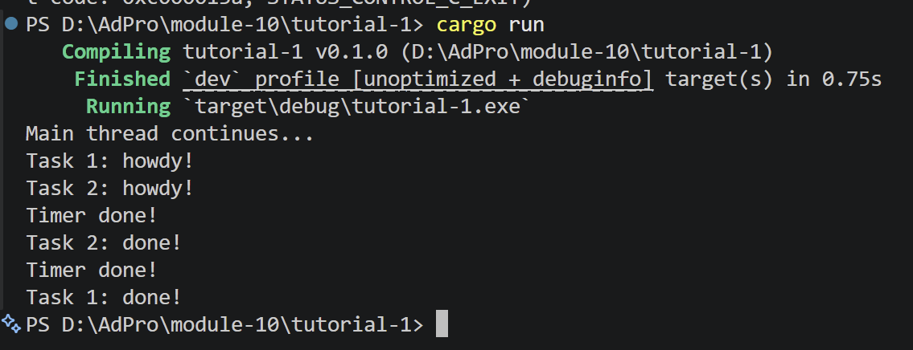
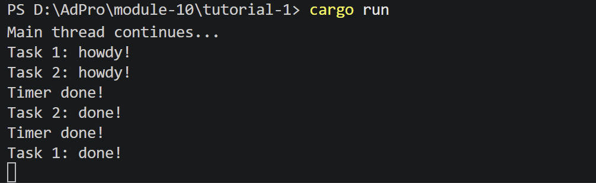
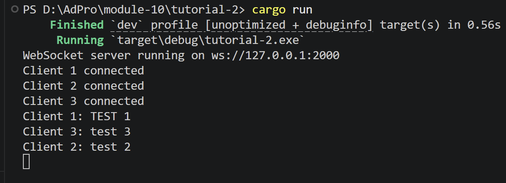

**Tutorial 1.2**

- Tulisan "hey hey" muncul lebih dahulu karena task async yang di-spawn belum langsung dijalankan. Saat spawner.spawn() dipanggil, task hanya dimasukkan ke dalam queue executor. Program kemudian langsung melanjutkan eksekusi ke baris berikutnya yaitu println!("hey hey"). Task async baru benar-benar dijalankan ketika executor.run() dipanggil. Executor mengambil task dari queue lalu melakukan polling terhadap future. Ketika mencapai .await, future akan berada pada status pending sampai timer selesai. Setelah timer selesai, waker akan membangunkan task sehingga executor dapat melanjutkan eksekusi future sampai selesai.

**Tutorial 1.3**
- Multiple Spawn

Program dimodifikasi agar memiliki dua task asynchronous yang berjalan bersamaan. Task pertama memiliki timer 2 detik, sedangkan task kedua memiliki timer 1 detik. Hasil menunjukkan bahwa task kedua selesai lebih dahulu walaupun di-spawn setelah task pertama. Hal ini terjadi karena executor dapat menjalankan task lain ketika sebuah future berada dalam kondisi pending.
- `drop(spawner)` dihapus

Saat `drop(spawner)` dihapus, program tidak berhenti walaupun semua task telah selesai dijalankan. Hal ini terjadi karena executor masih menunggu kemungkinan adanya task baru dari spawner. Channel komunikasi masih dianggap aktif karena spawner belum di-drop. Executor menjalankan loop `recv()` yang terus menunggu task baru masuk. Karena itu program menjadi hang sampai dihentikan secara manual menggunakan CTRL+C.

**Tutorial 2.1**

- Cara Menjalankan
1. Jalankan server dengan:
`cargo run`
2. Connect beberapa websocket client ke:
`ws://127.0.0.1:2000`
3. Kirim pesan dari salah satu client.

- Hasil
Pesan yang dikirim oleh satu client akan diterima oleh client lain secara realtime menggunakan websocket. Server menangani setiap client menggunakan asynchronous task dengan `tokio::spawn`. 

Setiap koneksi client dijalankan sebagai task asynchronous terpisah sehingga server dapat menangani banyak koneksi secara concurrent tanpa membuat thread besar untuk setiap client.